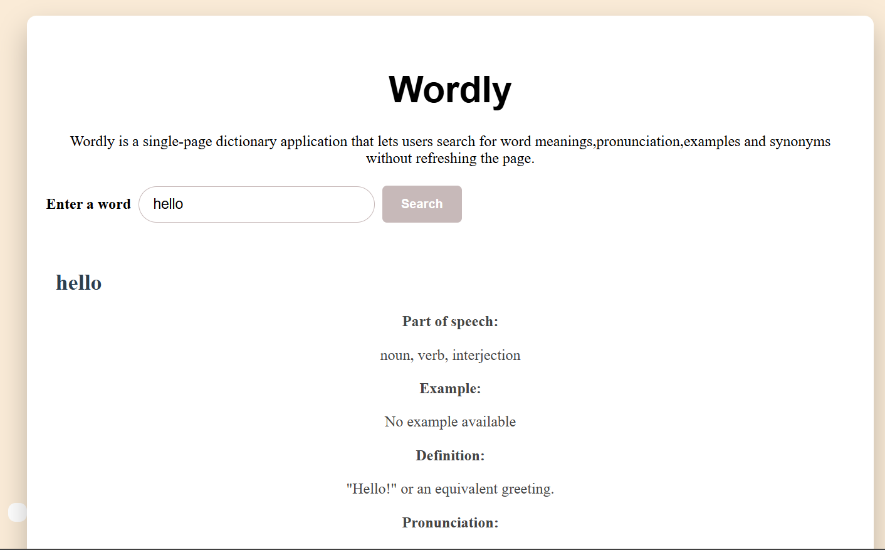

# Wordly Dictionary SPA

## Project Description

Wordly Dictionary SPA is a responsive web application that allows users to search for English words and instantly view their meanings, pronunciation, examples, synonyms, and audio pronunciation when available.

This project is built as a **Single Page Application (SPA)**, meaning all interactions happen on a single page without refreshing the browser. It uses the **Free Dictionary API** to retrieve real-time dictionary data.

---

## Features

-  Search for English words
-  View word definitions
-  Display parts of speech
-  Listen to audio pronunciation (when available)
-  View pronunciation text
-  Display example sentences
-  View synonyms
-  Save favorite words using localStorage
-  Display friendly error messages for invalid searches
-  Responsive design for desktop and mobile devices
-  Dynamic styling/theme support

---

## Technologies Used

- HTML5
- CSS3
- JavaScript (ES6)
- Free Dictionary API
- localStorage

---

## Project Structure

```
Wordly-Dictionary-SPA/
│
├── index.html
├── README.md
│
├── css/
│   └── style.css
│
├── js/
│   └── index.js
│
└── assets/
    └── screenshot.png
```

---

## How to Run the Project

1. Clone or download this repository.
2. Open the project folder.
3. Open **index.html** in your browser or use **Live Server** in Visual Studio Code.
4. Type an English word into the search box.
5. Click the **Search** button to display the results.

---

## API Information

This application uses the **Free Dictionary API**.

**Endpoint**

```
https://api.dictionaryapi.dev/api/v2/entries/en/{word}
```

The API retrieves:

- Definitions
- Parts of speech
- Pronunciation text
- Audio pronunciation
- Example sentences
- Synonyms
- Source URLs (when available)

---

## Usage

1. Enter an English word.
2. Click **Search**.
3. View the word definition and pronunciation.
4. Play the pronunciation audio if available.
5. Click the **Favorite** button to save the word.
6. Click the button again to remove it from favorites.

---

## Screenshot

### Application Preview



> Save my application screenshot inside the **assets** folder as **screenshot.png**.

---

## Live Demo

Deployed Application:

https://your-live-demo-link.com

---

## GitHub Repository

Repository:https://github.com/dorothykoskei-spec/SPA-lab.git

# Wordly Dictionary SPA

## Project Description

Wordly Dictionary SPA is a responsive web application that allows users to search for English words and instantly view their meanings, pronunciation, examples, synonyms, and audio pronunciation when available.

This project is built as a **Single Page Application (SPA)**, meaning all interactions happen on a single page without refreshing the browser. It uses the **Free Dictionary API** to retrieve real-time dictionary data.

---

## Features

-  Search for English words
-  View word definitions
-  Display parts of speech
-  Listen to audio pronunciation (when available)
-  View pronunciation text
-  Display example sentences
-  View synonyms
-  Save favorite words using localStorage
-  Display friendly error messages for invalid searches
-  Responsive design for desktop and mobile devices
-  Dynamic styling/theme support

---

## Technologies Used

- HTML5
- CSS3
- JavaScript (ES6)
- Free Dictionary API
- localStorage

---

## Project Structure

```
Wordly-Dictionary-SPA/
│
├── index.html
├── README.md
│
├── css/
│   └── style.css
│
├── js/
│   └── index.js
│
└── assets/
    └── screenshot.png
```

---

## How to Run the Project

1. Clone or download this repository.
2. Open the project folder.
3. Open **index.html** in your browser or use **Live Server** in Visual Studio Code.
4. Type an English word into the search box.
5. Click the **Search** button to display the results.

---

## API Information

This application uses the **Free Dictionary API**.

**Endpoint**

```
https://api.dictionaryapi.dev/api/v2/entries/en/{word}
```

The API retrieves:

- Definitions
- Parts of speech
- Pronunciation text
- Audio pronunciation
- Example sentences
- Synonyms
- Source URLs (when available)

---

## Usage

1. Enter an English word.
2. Click **Search**.
3. View the word definition and pronunciation.
4. Play the pronunciation audio if available.
5. Click the **Favorite** button to save the word.
6. Click the button again to remove it from favorites.

---

## Screenshot

### Application Preview


> Save your application screenshot inside the **assets** folder as **screenshot.png**.

---

## Live Demo

Deployed Application:

https://github.com/dorothykoskei-spec/SPA-lab/settings/pages

---

## GitHub Repository

Repository:
https://github.com/dorothykoskei-spec/SPA-lab.git

---

## Known Limitations

- Some words do not have pronunciation audio.
- Some words may not contain example sentences.
- Some words may not have synonyms.
- The application currently supports English words only.

---

## Author

**Dorothy Chemutai**

GitHub:

https://github.com/yourusername

---

## License

This project is intended for educational purposes only.

---

## Known Limitations

- Some words do not have pronunciation audio.
- Some words may not contain example sentences.
- Some words may not have synonyms.
- The application currently supports English words only.

---

## Author

**Dorothy Chemutai**

GitHub:

https://github.com/yourusername

---

## License

This project is intended for educational purposes only.